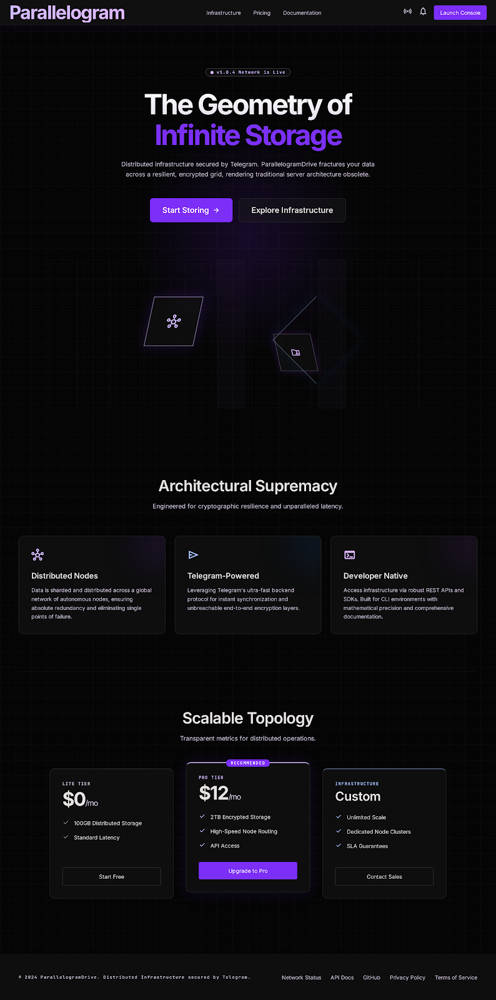
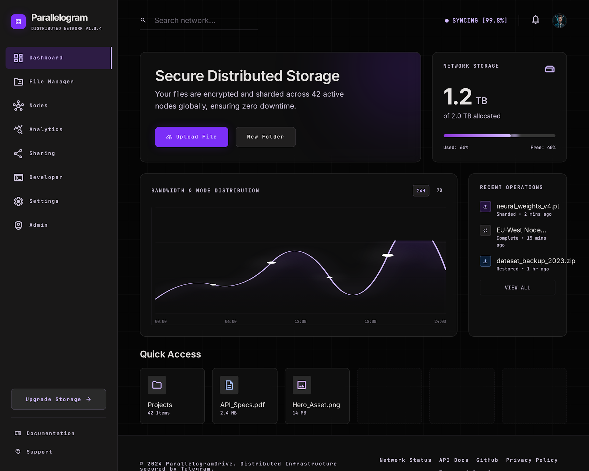
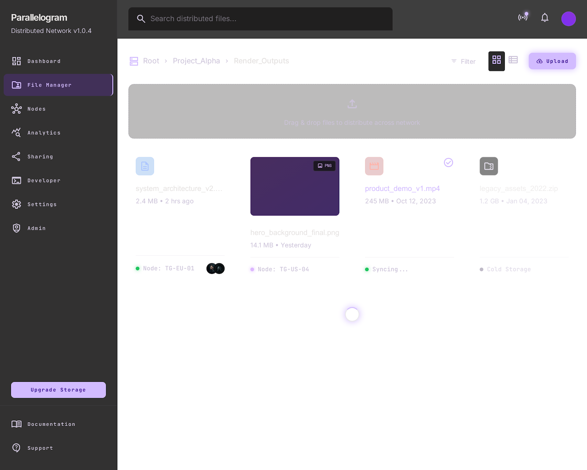
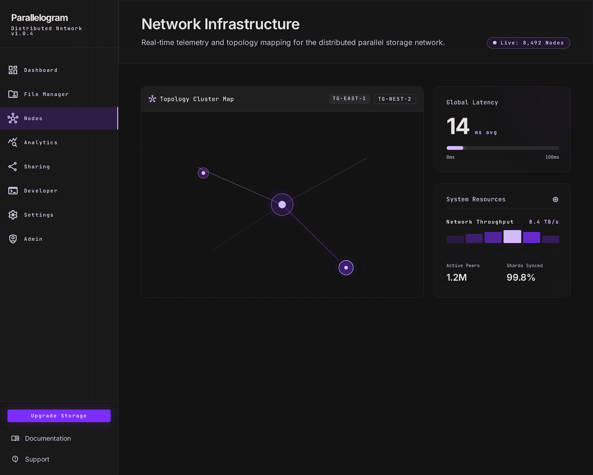
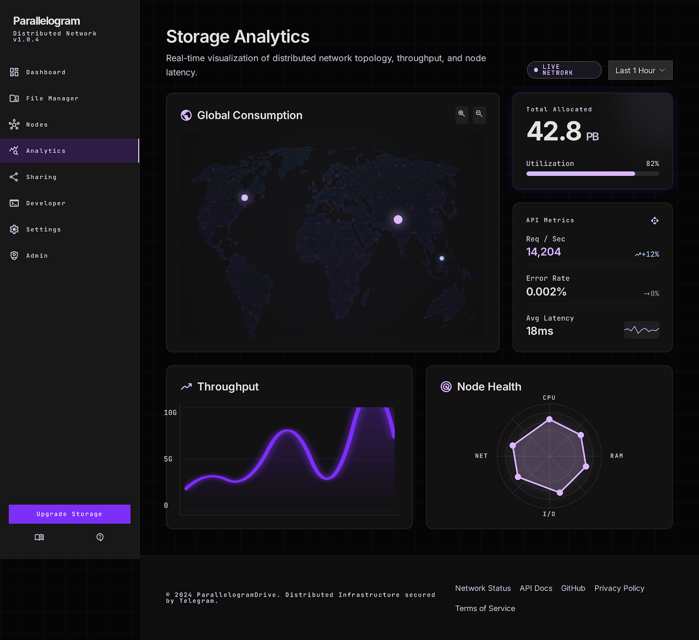
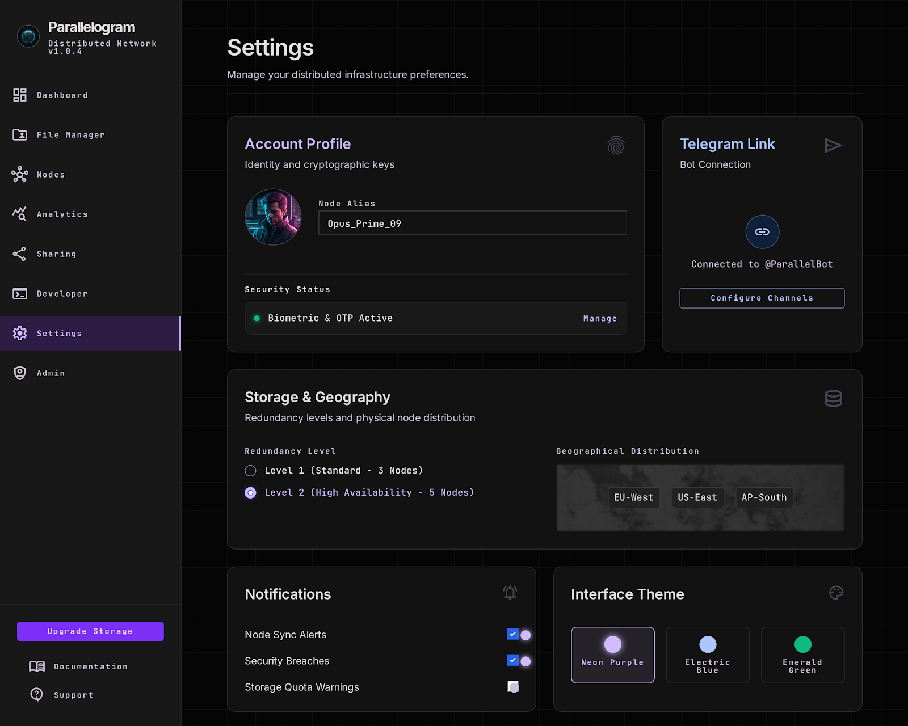
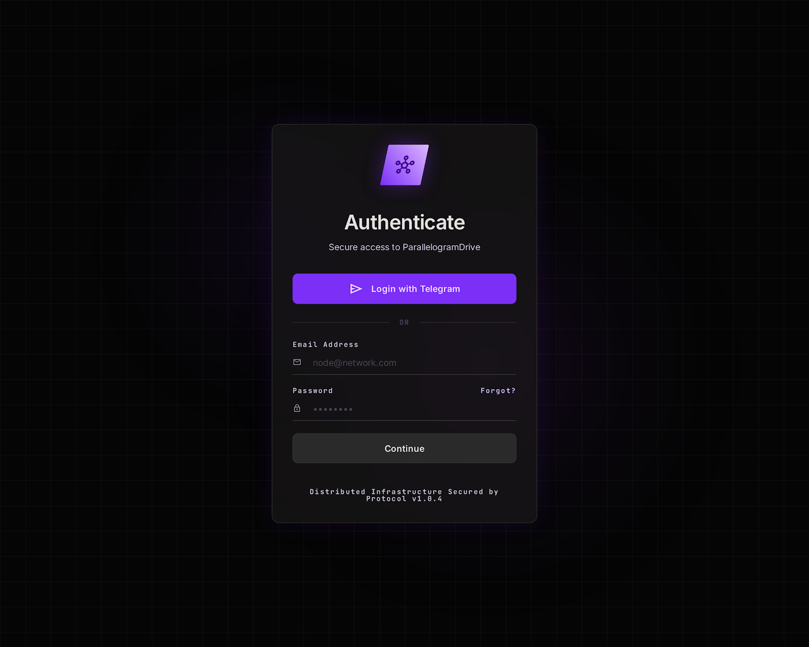
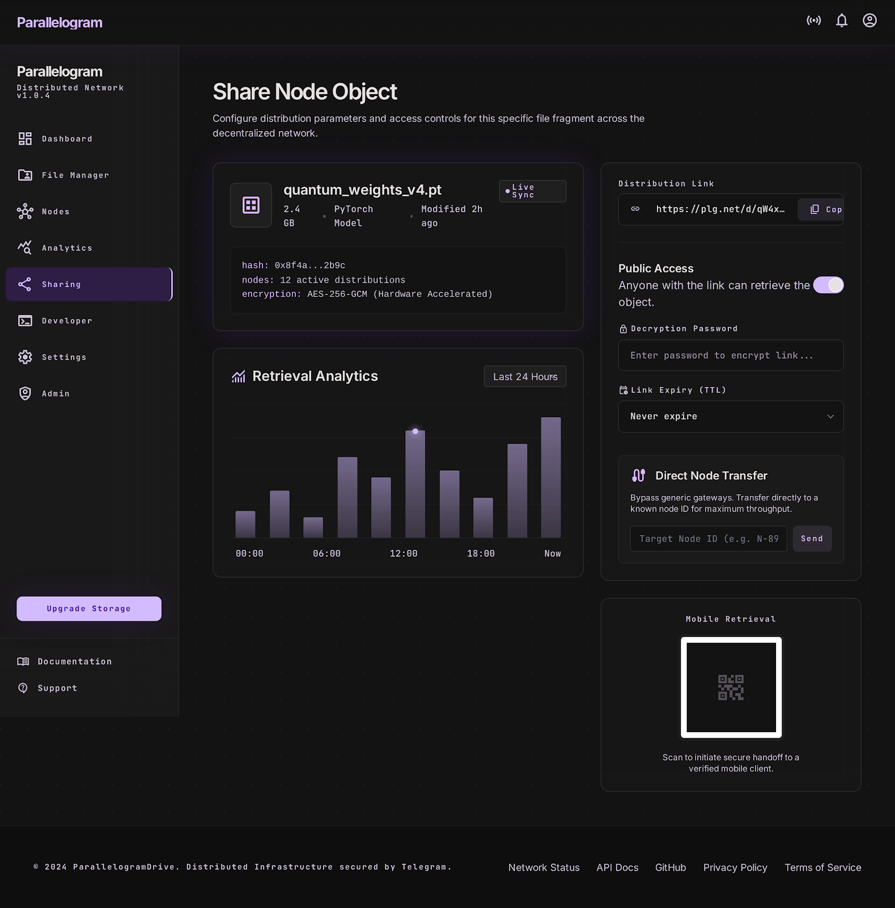
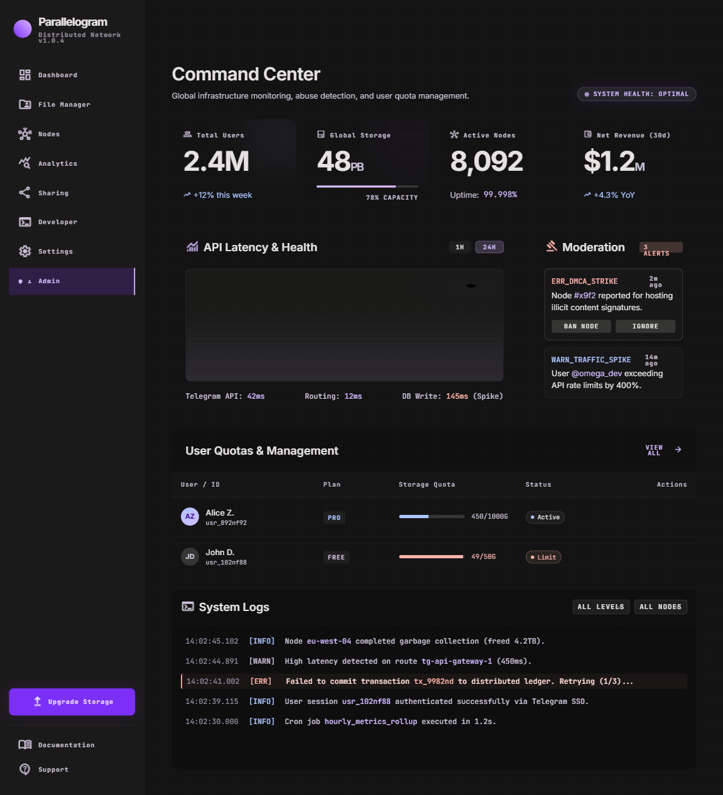
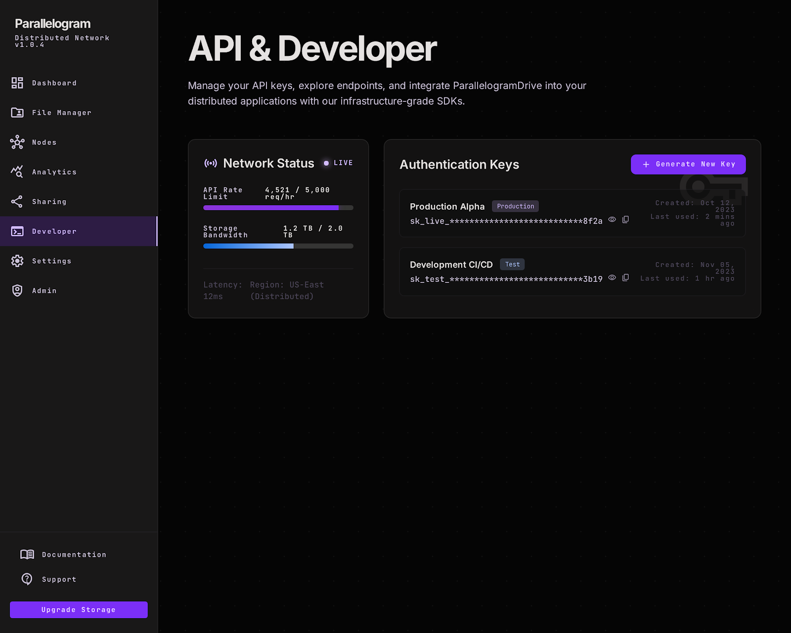

<div align="center">
  

  # ParallelogramDrive
  **The Geometry of Infinite Storage**

  <p align="center">
    A decentralized, hyper-scalable cloud storage infrastructure secured by Telegram's ultra-fast backend.
  </p>

  [](https://opensource.org/licenses/MIT)
  [](https://nextjs.org/)
  [](https://tailwindcss.com/)
  [](https://www.typescriptlang.org/)
</div>

---

## 🚀 Overview

**ParallelogramDrive** fractures your data across a resilient, encrypted grid, rendering traditional server architecture obsolete. By leveraging Telegram's massive distributed CDN, ParallelogramDrive gives you completely free, infinite storage capacity without compromising on speed or security.

### ✨ Key Features

- **Infinite Scalability:** Bypass traditional disk limits. Store petabytes of data leveraging a distributed node grid.
- **Global Node Network:** Lightning-fast downloads with zero cold starts, distributed globally.
- **Military-Grade Security:** Every file is encrypted in transit and at rest.
- **Authentic Material UI:** Premium, glassmorphic UI built with Tailwind v4, custom CSS variables, and fluid animations.
- **Native Video/Audio Streaming:** Stream media files natively directly from the distributed grid using HTTP Range requests.

---

## 📸 Interface Previews

Our application features a stunning, state-of-the-art interface.

### Dashboard & File Manager
 

### Infrastructure & Analytics
 

### Settings & Authentication
 

### Share Files & Admin Panel
 

### Developer Portal


---

## 🛠️ Architecture

1. **Frontend:** Next.js App Router, React 19, TailwindCSS v4, Clerk Auth.
2. **Database:** Prisma ORM connected to a managed PostgreSQL database.
3. **Storage Layer:** Telegram Bot API acts as a high-speed CDN, chunking and routing files across the network.
4. **Proxy:** An intelligent streaming proxy (`/api/stream`) sits between the frontend and the CDN to allow native browser seeking and chunked media playback.

---

## 💻 Getting Started

### Prerequisites
- Node.js >= 20.x
- A PostgreSQL Database
- A Telegram Bot Token & Chat ID
- Clerk Authentication Keys

### Installation

1. **Clone the repository**
   ```bash
   git clone https://github.com/techxsarwar/ParallelogramDrive.git
   cd ParallelogramDrive
   ```

2. **Install dependencies**
   ```bash
   npm install
   ```

3. **Configure Environment Variables**
   Create a `.env.local` file with the following variables:
   ```env
   NEXT_PUBLIC_CLERK_PUBLISHABLE_KEY=your_clerk_pub_key
   CLERK_SECRET_KEY=your_clerk_secret_key
   TELEGRAM_BOT_TOKEN=your_telegram_bot_token
   TELEGRAM_CHAT_ID=your_telegram_chat_id
   DATABASE_URL=your_postgres_db_url
   ```

4. **Run Database Migrations**
   ```bash
   npx prisma db push
   ```

5. **Start the Development Server**
   ```bash
   npm run dev
   ```

Your dashboard will be available at [http://localhost:3000](http://localhost:3000).

---

## 📜 License

This project is licensed under the MIT License.
